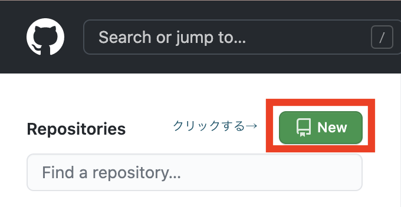
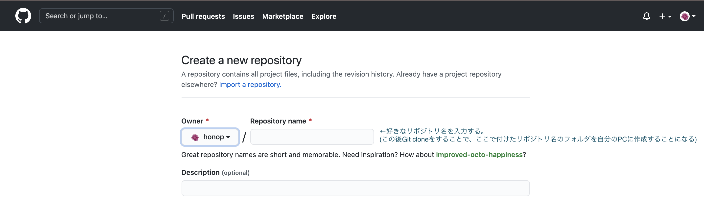
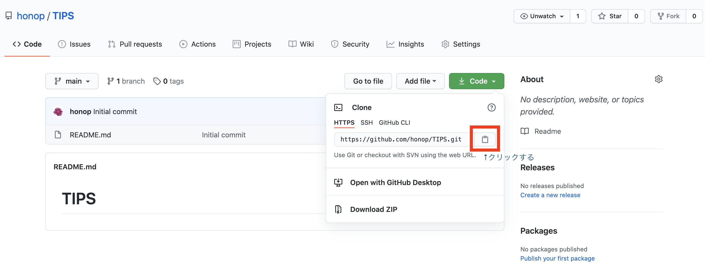

# git cloneの使い方

## やりたいこと
* Git cloneで、リモートリポジトリをローカルにも作成する

## やり方
1. GitHubにてリポジトリを作成する

    
    

    この後git cloneをすることで、ここで付けたリポジトリ名のフォルダを自分のPCに作成することになる。

2. ターミナルを立ち上げる  
* ターミナルを起動する。  
    先ほど作ったリモートリポジトリと同じ名前のフォルダを作りたい場所(ディレクトリ)に移動(cdコマンドを使用)する。  
    今回はGitHubというディレクトリ(フォルダ)を作った。
    
    ↑移動できた

3.  先ほど作成したGitHubのリモートリポジトリのURLをコピーする
    
    緑色の"Code"ボタンをクリックすると、上記のような画面になる。  
    赤い枠で囲まれた部分をクリックすると簡単にコピーできる。

4.  ターミナルに戻り、先ほどコピーしたGitHubのリモートリポジトリのURLを使ってgit cloneする
    
    ENTERボタンを押せば、自分の指定したディレクトリ(今回は"GitHub"という名前のフォルダ)にリモートリポジトリと同じ名前のフォルダが作成されたことが確認できるはずだ。