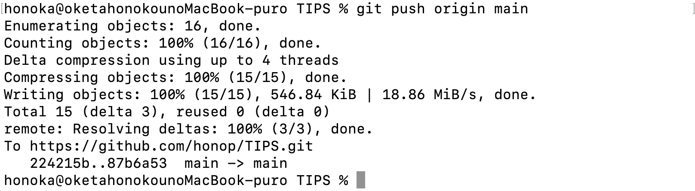

# git add、commit、pushのやり方

## やりたいこと
* ローカルリポジトリ内の新たなファイルをリモートリポジトリにアップすること


## 前提として
* git cloneを用いて既にリモートリポジトリとローカルリポジトリを同期させていることが必要。やり方はGit_Clone.mdにて。

## やり方
1. まずcdコマンドでローカルリポジトリに移動する。
    
    ↑移動できた。

2. git statusでUntrackedFileの確認
    
    まだローカルのgitに反映されていないファイルの一覧が表示された。

3. git add -iで対話モードに移行する
    
    ここで、4と打つとuntracked fileが羅列される
    
    ```
    Add untracked>> 
    ```
    と表示されるので、Allの意味を持つ*(アスタリスク)を打つと、無事ローカルリポジトリに全てのフォルダが保存される。  
    対話モードを終了させるためにはqを打つ。

4. git add .をする  
    ```
    git add .  
    git commit -m "お好きなコメント何でも"
    ```
    と打つ
    

5. git pushをする
    
    mainに反映させるため、
    ```  
    git push origin main  
    ```
    と打つ
    
    
    ↑無事リモートリポジトリにも新規ファイルが反映された！


